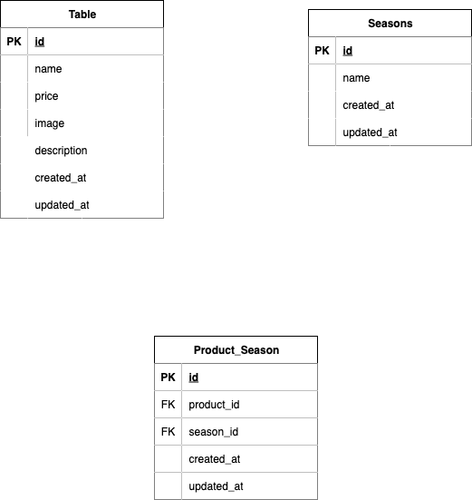

# mogitate 商品管理システム

商品の一覧表示、検索、ソート、編集・削除機能を持つ Web アプリケーションです。

## 環境構築

### 前提条件

- Docker
- Docker Compose

### セットアップ手順

1. **リポジトリのクローン**

```bash
git clone git@github.com:apuzou/coachtech_test2.git
cd coachtech_test2
```

2. **Docker コンテナのビルド・起動**

```bash
docker-compose up -d --build
```

3. **PHP コンテナに入る**

```bash
docker-compose exec php bash
```

4. **Laravel の初期設定**

```bash
# Composerの依存関係をインストール
composer install

# 環境設定ファイルの作成
cp .env.example .env

# アプリケーションキーの生成
php artisan key:generate

# ストレージリンクの作成
php artisan storage:link
```

5. **データベースのマイグレーション・シーディング**

```bash
# マイグレーション実行
php artisan migrate

# シーダー実行（季節データと商品データの投入）
php artisan db:seed
```

## 使用技術(実行環境)

- **PHP**: 8.1
- **Laravel**: 8.75
- **MySQL**: 8.0.26
- **Nginx**: 1.21.1
- **Docker**: Docker Compose 環境
- **Composer**: 依存関係管理

## ER 図


## URL

- **開発環境**: http://localhost/products
- **phpMyAdmin**: http://localhost:8080
  - ユーザー名: laravel_user
  - パスワード: laravel_pass
